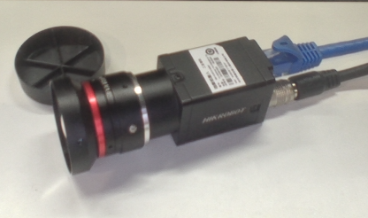
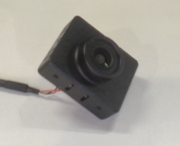

# Camera Drivers
作者：Komasa Qi

## 内容说明
本项目包含了一些相机驱动的代码，用于在Linux系统下控制相机的工作。
- 海康机器人工业相机 MV-CU013-AOGC


- 轮趣科技USB相机 C100

<div style="display: flex; justify-content: center; align-items: center; gap: 2%;">

  

  

</div>


## 安装步骤
1. 克隆本仓库到本地并编译：

``` bash
git clone https://github.com/KomasaQi/Camera_Drivers.git
cd Camera_Drivers
catkin_make
```

2. 配置环境变量：
``` bash
source ~/Camera_Drivers/devel/setup.bash
```
3. 连接相机并启动驱动节点：
``` bash
roslaunch hk_cam hk_cam.launch
```
或
``` bash    
roslaunch usb_camera usb_camera.launch
```

标定详细参见每个包内的README.md文件。